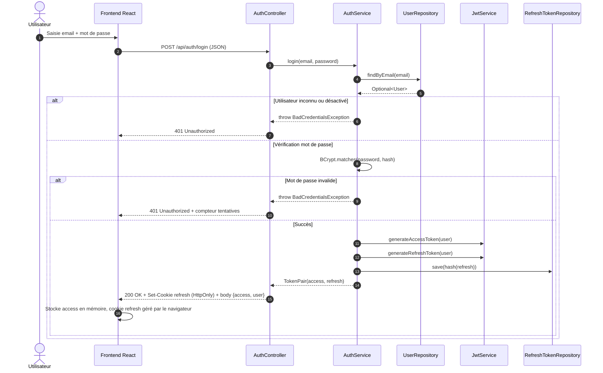
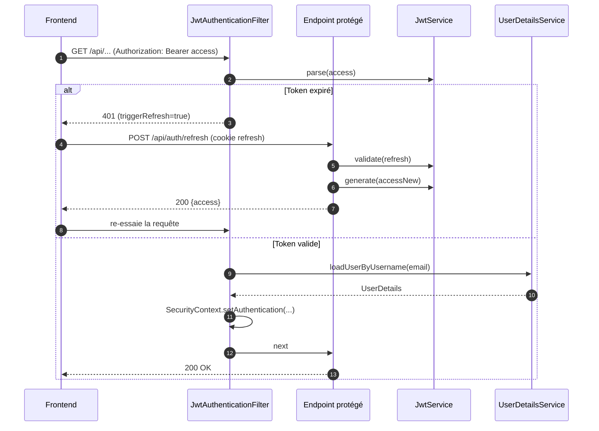

# Séquence — Authentification

```mermaid
sequenceDiagram
    autonumber
    actor U as Utilisateur
    participant FE as Frontend React
    participant BE as AuthController
    participant AS as AuthService
    participant UR as UserRepository
    participant JS as JwtService
    participant RT as RefreshTokenRepository

    U->>FE: Saisie email + mot de passe
    FE->>BE: POST /api/auth/login (JSON)
    BE->>AS: login(email, password)
    AS->>UR: findByEmail(email)
    UR-->>AS: Optional<User>
    alt Utilisateur inconnu ou désactivé
        AS-->>BE: throw BadCredentialsException
        BE-->>FE: 401 Unauthorized
    else Vérification mot de passe
        AS->>AS: BCrypt.matches(password, hash)
        alt Mot de passe invalide
            AS-->>BE: throw BadCredentialsException
            BE-->>FE: 401 Unauthorized + compteur tentatives
        else Succès
            AS->>JS: generateAccessToken(user)
            AS->>JS: generateRefreshToken(user)
            AS->>RT: save(hash(refresh))
            AS-->>BE: TokenPair(access, refresh)
            BE-->>FE: 200 OK + Set-Cookie refresh (HttpOnly) + body {access, user}
            FE->>FE: Stocke access en mémoire, cookie refresh géré par le navigateur
        end
    end
```

```mermaid
sequenceDiagram
    autonumber
    participant FE as Frontend
    participant F as JwtAuthenticationFilter
    participant BE as Endpoint protégé
    participant JS as JwtService
    participant UDS as UserDetailsService

    FE->>F: GET /api/... (Authorization: Bearer access)
    F->>JS: parse(access)
    alt Token expiré
        F-->>FE: 401 (triggerRefresh=true)
        FE->>BE: POST /api/auth/refresh (cookie refresh)
        BE->>JS: validate(refresh)
        BE->>JS: generate(accessNew)
        BE-->>FE: 200 {access}
        FE->>F: re-essaie la requête
    else Token valide
        F->>UDS: loadUserByUsername(email)
        UDS-->>F: UserDetails
        F->>F: SecurityContext.setAuthentication(...)
        F->>BE: next
        BE-->>FE: 200 OK
    end
```
