# 05 — Diagrammes de séquence

## 1. Introduction

Ce document rassemble les 20 diagrammes de séquence demandés. Chacun représente les interactions entre les composants effectivement présents dans le code :

- `Utilisateur` — acteur humain.
- `React UI` — composant de page React (LoginPage, MailListPage, etc.).
- `Axios API` — instance `api` avec intercepteur ([apiClient.ts](../../eni-mail-frontend/src/services/apiClient.ts)).
- `Spring MVC` — contrôleur REST + filtre JWT.
- `Service` — service métier (`AuthService`, `MessageService`, etc.).
- `Repository` — repository Spring Data MongoDB.
- `MongoDB` — base de données.
- `Disque` — filesystem local pour les pièces jointes.

Les diagrammes utilisent la notation Mermaid et les fragments UML `alt`, `opt`, `loop`.

---

## 2. SQ-01 — Authentification

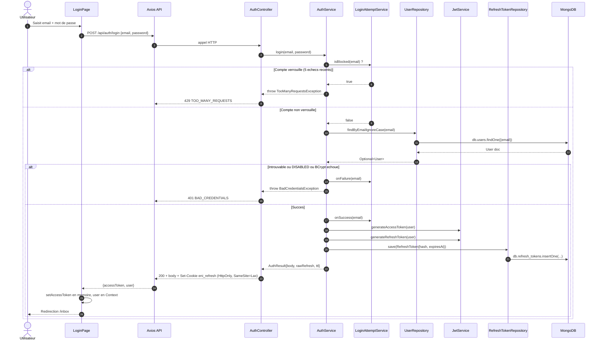
```mermaid
sequenceDiagram
    autonumber
    actor U as Utilisateur
    participant UI as LoginPage
    participant AX as Axios API
    participant CTL as AuthController
    participant AS as AuthService
    participant LA as LoginAttemptService
    participant UR as UserRepository
    participant JS as JwtService
    participant RTR as RefreshTokenRepository
    participant DB as MongoDB

    U->>UI: Saisit email + mot de passe
    UI->>AX: POST /api/auth/login {email, password}
    AX->>CTL: appel HTTP
    CTL->>AS: login(email, password)
    AS->>LA: isBlocked(email) ?
    alt Compte verrouille (5 echecs recents)
        LA-->>AS: true
        AS-->>CTL: throw TooManyRequestsException
        CTL-->>AX: 429 TOO_MANY_REQUESTS
    else Compte non verrouille
        LA-->>AS: false
        AS->>UR: findByEmailIgnoreCase(email)
        UR->>DB: db.users.findOne({email})
        DB-->>UR: User doc
        UR-->>AS: Optional<User>
        alt Introuvable ou DISABLED ou BCrypt echoue
            AS->>LA: onFailure(email)
            AS-->>CTL: throw BadCredentialsException
            CTL-->>AX: 401 BAD_CREDENTIALS
        else Succes
            AS->>LA: onSuccess(email)
            AS->>JS: generateAccessToken(user)
            AS->>JS: generateRefreshToken(user)
            AS->>RTR: save(RefreshToken{hash, expiresAt})
            RTR->>DB: db.refresh_tokens.insertOne(...)
            AS-->>CTL: AuthResult{body, rawRefresh, ttl}
            CTL-->>AX: 200 + body + Set-Cookie eni_refresh (HttpOnly, SameSite=Lax)
            AX-->>UI: {accessToken, user}
            UI->>UI: setAccessToken en memoire, user en Context
            UI-->>U: Redirection /inbox
        end
    end
```

**Points clés** : BCrypt (12), rate-limit, cookie HttpOnly, token access en mémoire du front.

---

## 3. SQ-02 — Déconnexion

```mermaid
sequenceDiagram
    autonumber
    actor U as Utilisateur
    participant UI as AppLayout
    participant AX as Axios API
    participant CTL as AuthController
    participant AS as AuthService
    participant RTR as RefreshTokenRepository

    U->>UI: Clic "Se deconnecter"
    UI->>AX: POST /api/auth/logout (cookie eni_refresh envoye)
    AX->>CTL: appel
    CTL->>AS: logout(rawRefresh)
    opt Cookie present et valide
        AS->>RTR: findByTokenHash(sha256(raw))
        RTR-->>AS: RefreshToken
        AS->>RTR: save(tokenHash, revoked=true)
    end
    CTL-->>AX: 204 + Set-Cookie eni_refresh=""; Max-Age=0
    AX-->>UI: 204
    UI->>UI: setAccessToken(null), user=null
    UI-->>U: Redirection /login
```

---

## 4. SQ-03 — Création d'un utilisateur par l'administrateur

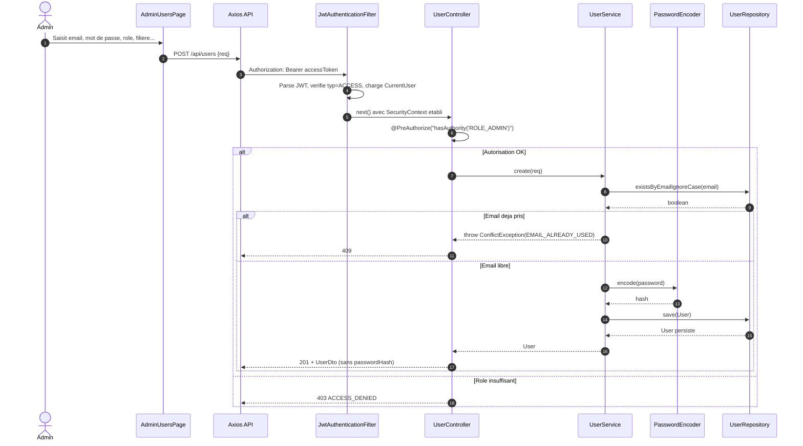
```mermaid
sequenceDiagram
    autonumber
    actor A as Admin
    participant UI as AdminUsersPage
    participant AX as Axios API
    participant F as JwtAuthenticationFilter
    participant CTL as UserController
    participant S as UserService
    participant PE as PasswordEncoder
    participant UR as UserRepository

    A->>UI: Saisit email, mot de passe, role, filiere...
    UI->>AX: POST /api/users {req}
    AX->>F: Authorization: Bearer accessToken
    F->>F: Parse JWT, verifie typ=ACCESS, charge CurrentUser
    F->>CTL: next() avec SecurityContext etabli
    CTL->>CTL: @PreAuthorize("hasAuthority('ROLE_ADMIN')")
    alt Autorisation OK
        CTL->>S: create(req)
        S->>UR: existsByEmailIgnoreCase(email)
        UR-->>S: boolean
        alt Email deja pris
            S-->>CTL: throw ConflictException(EMAIL_ALREADY_USED)
            CTL-->>AX: 409
        else Email libre
            S->>PE: encode(password)
            PE-->>S: hash
            S->>UR: save(User)
            UR-->>S: User persiste
            S-->>CTL: User
            CTL-->>AX: 201 + UserDto (sans passwordHash)
        end
    else Role insuffisant
        CTL-->>AX: 403 ACCESS_DENIED
    end
```

---

## 5. SQ-04 — Envoi d'un message à un utilisateur

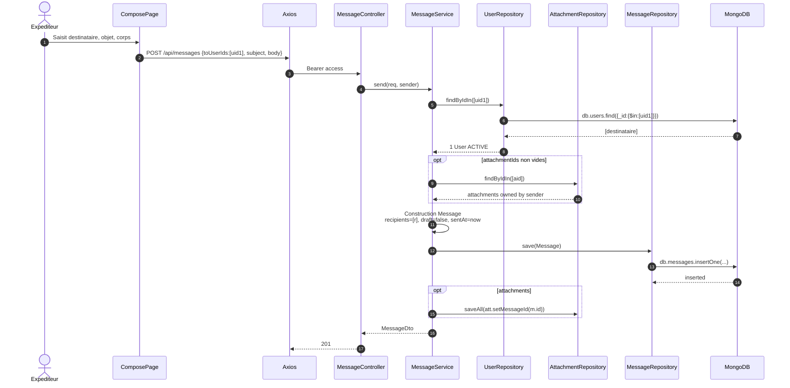
```mermaid
sequenceDiagram
    autonumber
    actor U as Expediteur
    participant UI as ComposePage
    participant AX as Axios
    participant CTL as MessageController
    participant S as MessageService
    participant UR as UserRepository
    participant AR as AttachmentRepository
    participant MR as MessageRepository
    participant DB as MongoDB

    U->>UI: Saisit destinataire, objet, corps
    UI->>AX: POST /api/messages {toUserIds:[uid1], subject, body}
    AX->>CTL: Bearer access
    CTL->>S: send(req, sender)
    S->>UR: findByIdIn([uid1])
    UR->>DB: db.users.find({_id:{$in:[uid1]}})
    DB-->>UR: [destinataire]
    UR-->>S: 1 User ACTIVE
    opt attachmentIds non vides
        S->>AR: findByIdIn([aid])
        AR-->>S: attachments owned by sender
    end
    S->>S: Construction Message<br/>recipients=[r], draft=false, sentAt=now
    S->>MR: save(Message)
    MR->>DB: db.messages.insertOne(...)
    DB-->>MR: inserted
    opt attachments
        S->>AR: saveAll(att.setMessageId(m.id))
    end
    S-->>CTL: MessageDto
    CTL-->>AX: 201
```

---

## 6. SQ-05 — Envoi à plusieurs destinataires

Identique à SQ-04 mais `toUserIds.size > 1`. Points spécifiques :

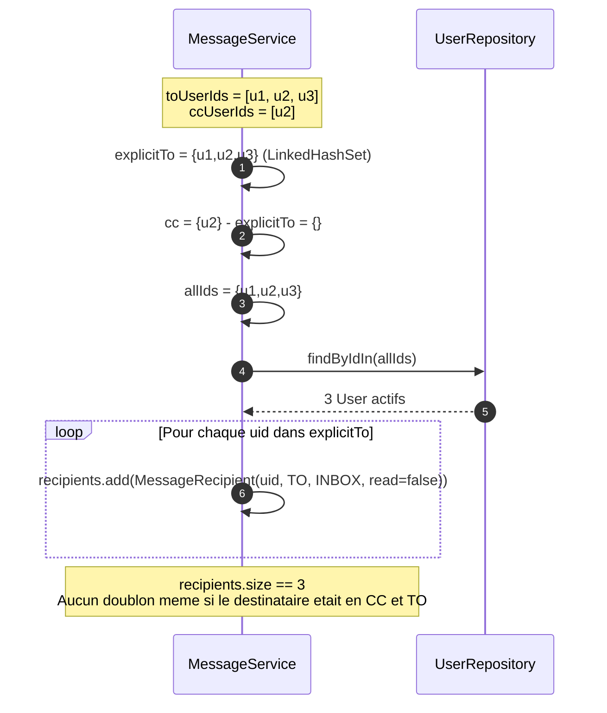
```mermaid
sequenceDiagram
    autonumber
    participant S as MessageService
    participant UR as UserRepository

    Note over S: toUserIds = [u1, u2, u3]<br/>ccUserIds = [u2]
    S->>S: explicitTo = {u1,u2,u3} (LinkedHashSet)
    S->>S: cc = {u2} - explicitTo = {}
    S->>S: allIds = {u1,u2,u3}
    S->>UR: findByIdIn(allIds)
    UR-->>S: 3 User actifs
    loop Pour chaque uid dans explicitTo
        S->>S: recipients.add(MessageRecipient(uid, TO, INBOX, read=false))
    end
    Note over S: recipients.size == 3<br/>Aucun doublon meme si le destinataire etait en CC et TO
```

---

## 7. SQ-06 — Réception et consultation d'un message

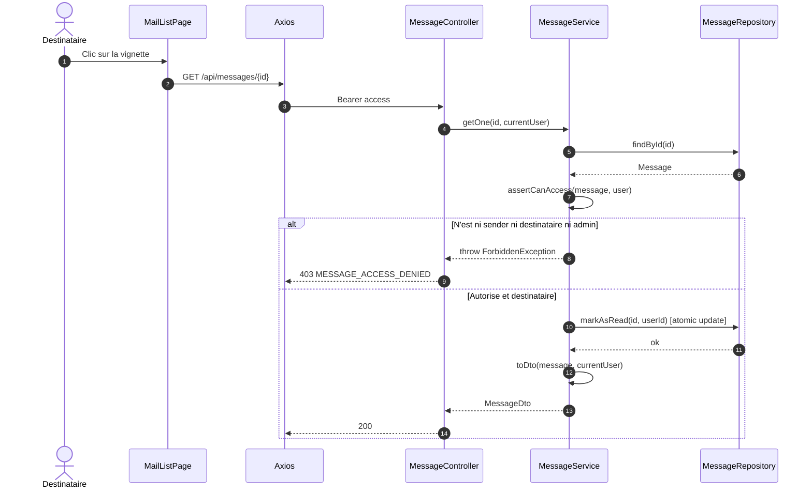
```mermaid
sequenceDiagram
    autonumber
    actor D as Destinataire
    participant UI as MailListPage
    participant AX as Axios
    participant CTL as MessageController
    participant S as MessageService
    participant MR as MessageRepository

    D->>UI: Clic sur la vignette
    UI->>AX: GET /api/messages/{id}
    AX->>CTL: Bearer access
    CTL->>S: getOne(id, currentUser)
    S->>MR: findById(id)
    MR-->>S: Message
    S->>S: assertCanAccess(message, user)
    alt N'est ni sender ni destinataire ni admin
        S-->>CTL: throw ForbiddenException
        CTL-->>AX: 403 MESSAGE_ACCESS_DENIED
    else Autorise et destinataire
        S->>MR: markAsRead(id, userId) [atomic update]
        MR-->>S: ok
        S->>S: toDto(message, currentUser)
        S-->>CTL: MessageDto
        CTL-->>AX: 200
    end
```

---

## 8. SQ-07 — Marquer comme lu / non lu

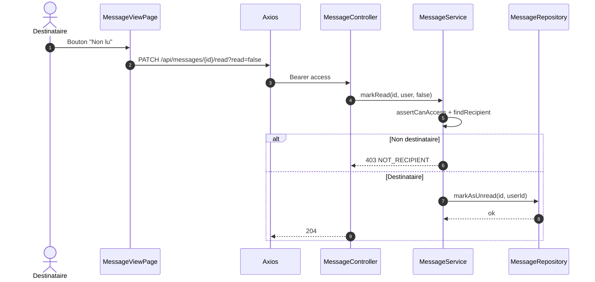
```mermaid
sequenceDiagram
    autonumber
    actor D as Destinataire
    participant UI as MessageViewPage
    participant AX as Axios
    participant CTL as MessageController
    participant S as MessageService
    participant MR as MessageRepository

    D->>UI: Bouton "Non lu"
    UI->>AX: PATCH /api/messages/{id}/read?read=false
    AX->>CTL: Bearer access
    CTL->>S: markRead(id, user, false)
    S->>S: assertCanAccess + findRecipient
    alt Non destinataire
        S-->>CTL: 403 NOT_RECIPIENT
    else Destinataire
        S->>MR: markAsUnread(id, userId)
        MR-->>S: ok
        CTL-->>AX: 204
    end
```

Mise à jour atomique MongoDB :

```js
db.messages.updateOne(
  { _id: id, "recipients.userId": userId },
  { $set:   { "recipients.$.read": false },
    $unset: { "recipients.$.readAt": "" } }
)
```

---

## 9. SQ-08 — Réponse à un message

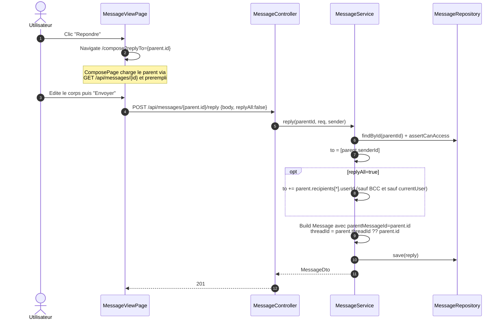
```mermaid
sequenceDiagram
    autonumber
    actor U as Utilisateur
    participant UI as MessageViewPage
    participant CTL as MessageController
    participant S as MessageService
    participant MR as MessageRepository

    U->>UI: Clic "Repondre"
    UI->>UI: Navigate /compose?replyTo={parent.id}
    Note over UI: ComposePage charge le parent via<br/>GET /api/messages/{id} et prerempli
    U->>UI: Edite le corps puis "Envoyer"
    UI->>CTL: POST /api/messages/{parent.id}/reply {body, replyAll:false}
    CTL->>S: reply(parentId, req, sender)
    S->>MR: findById(parentId) + assertCanAccess
    S->>S: to = [parent.senderId]
    opt replyAll=true
        S->>S: to += parent.recipients[*].userId (sauf BCC et sauf currentUser)
    end
    S->>S: Build Message avec parentMessageId=parent.id<br/>threadId = parent.threadId ?? parent.id
    S->>MR: save(reply)
    S-->>CTL: MessageDto
    CTL-->>UI: 201
```

---

## 10. SQ-09 — Transfert

Similaire à SQ-08 mais :

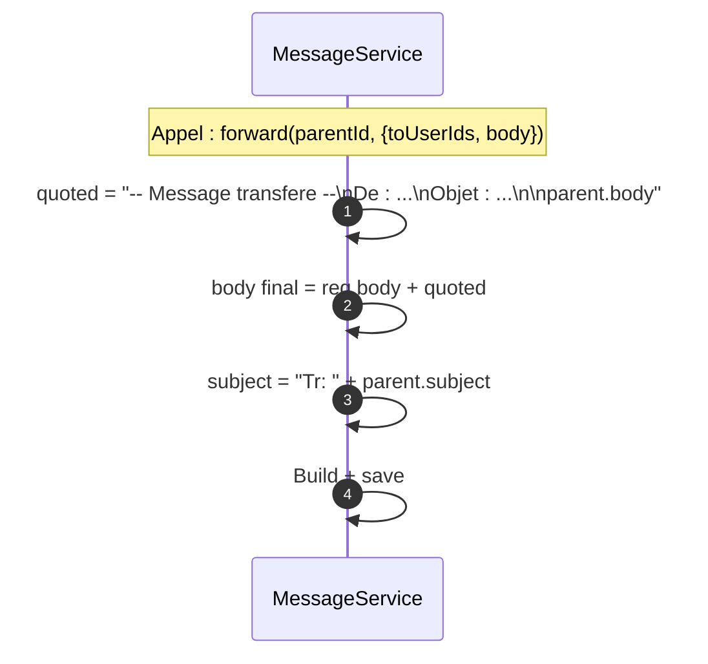
```mermaid
sequenceDiagram
    autonumber
    participant S as MessageService
    Note over S: Appel : forward(parentId, {toUserIds, body})
    S->>S: quoted = "-- Message transfere --\nDe : ...\nObjet : ...\n\nparent.body"
    S->>S: body final = req.body + quoted
    S->>S: subject = "Tr: " + parent.subject
    S->>S: Build + save
```

Pas de copie des pièces jointes du parent (choix V1 ; peut être ajouté sans changer l'API en ajoutant un flag `includeAttachments`).

---

## 11. SQ-10 — Enregistrement d'un brouillon

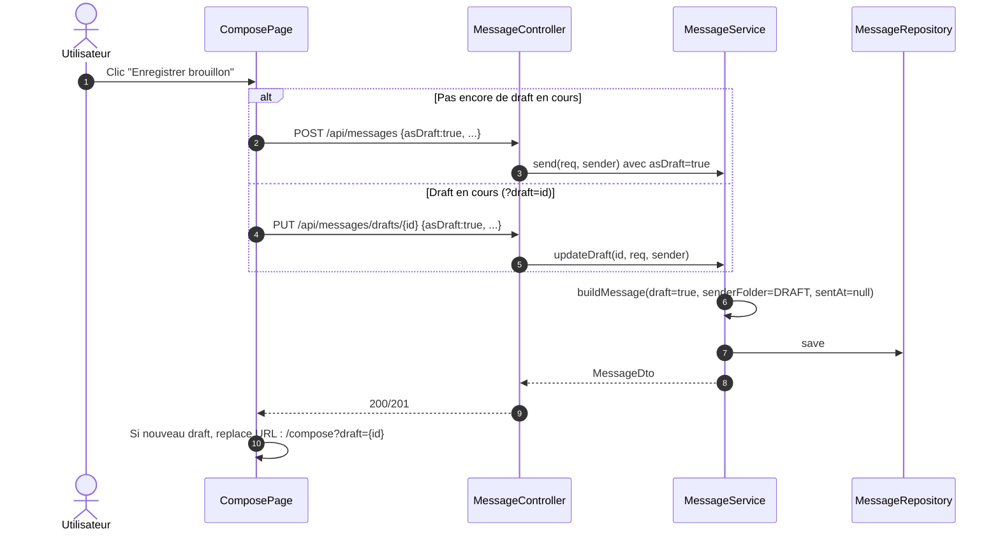
```mermaid
sequenceDiagram
    autonumber
    actor U as Utilisateur
    participant UI as ComposePage
    participant CTL as MessageController
    participant S as MessageService
    participant MR as MessageRepository

    U->>UI: Clic "Enregistrer brouillon"
    alt Pas encore de draft en cours
        UI->>CTL: POST /api/messages {asDraft:true, ...}
        CTL->>S: send(req, sender) avec asDraft=true
    else Draft en cours (?draft=id)
        UI->>CTL: PUT /api/messages/drafts/{id} {asDraft:true, ...}
        CTL->>S: updateDraft(id, req, sender)
    end
    S->>S: buildMessage(draft=true, senderFolder=DRAFT, sentAt=null)
    S->>MR: save
    S-->>CTL: MessageDto
    CTL-->>UI: 200/201
    UI->>UI: Si nouveau draft, replace URL : /compose?draft={id}
```

---

## 12. SQ-11 — Envoi à un groupe

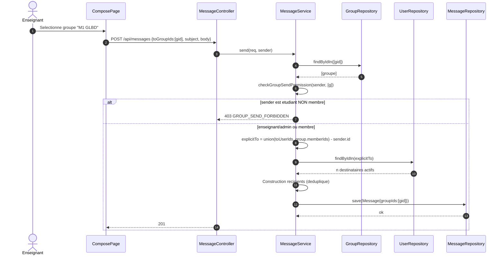
```mermaid
sequenceDiagram
    autonumber
    actor P as Enseignant
    participant UI as ComposePage
    participant CTL as MessageController
    participant S as MessageService
    participant GR as GroupRepository
    participant UR as UserRepository
    participant MR as MessageRepository

    P->>UI: Selectionne groupe "M1 GLBD"
    UI->>CTL: POST /api/messages {toGroupIds:[gid], subject, body}
    CTL->>S: send(req, sender)
    S->>GR: findByIdIn([gid])
    GR-->>S: [groupe]
    S->>S: checkGroupSendPermission(sender, [g])
    alt sender est etudiant NON membre
        S-->>CTL: 403 GROUP_SEND_FORBIDDEN
    else enseignant/admin ou membre
        S->>S: explicitTo = union(toUserIds, group.memberIds) - sender.id
        S->>UR: findByIdIn(explicitTo)
        UR-->>S: n destinataires actifs
        S->>S: Construction recipients (deduplique)
        S->>MR: save(Message{groupIds:[gid]})
        MR-->>S: ok
        CTL-->>UI: 201
    end
```

---

## 13. SQ-12 — Ajout d'une pièce jointe

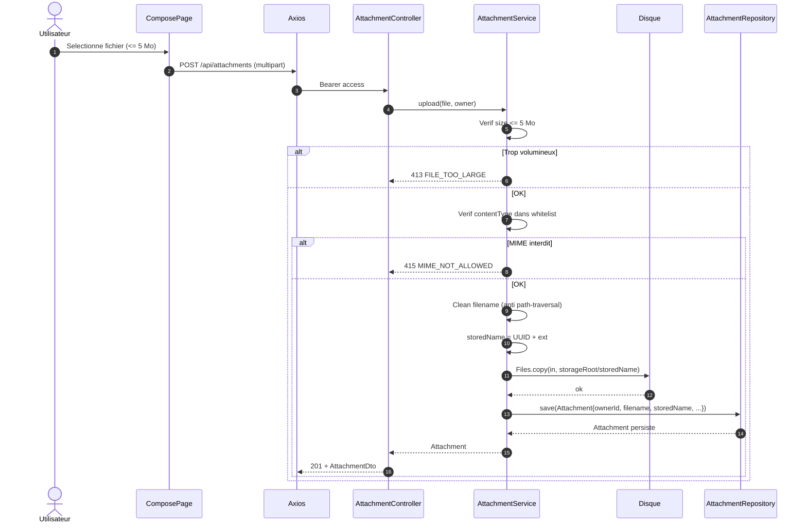
```mermaid
sequenceDiagram
    autonumber
    actor U as Utilisateur
    participant UI as ComposePage
    participant AX as Axios
    participant CTL as AttachmentController
    participant S as AttachmentService
    participant FS as Disque
    participant AR as AttachmentRepository

    U->>UI: Selectionne fichier (<= 5 Mo)
    UI->>AX: POST /api/attachments (multipart)
    AX->>CTL: Bearer access
    CTL->>S: upload(file, owner)
    S->>S: Verif size <= 5 Mo
    alt Trop volumineux
        S-->>CTL: 413 FILE_TOO_LARGE
    else OK
        S->>S: Verif contentType dans whitelist
        alt MIME interdit
            S-->>CTL: 415 MIME_NOT_ALLOWED
        else OK
            S->>S: Clean filename (anti path-traversal)
            S->>S: storedName = UUID + ext
            S->>FS: Files.copy(in, storageRoot/storedName)
            FS-->>S: ok
            S->>AR: save(Attachment{ownerId, filename, storedName, ...})
            AR-->>S: Attachment persiste
            S-->>CTL: Attachment
            CTL-->>AX: 201 + AttachmentDto
        end
    end
```

---

## 14. SQ-13 — Téléchargement d'une pièce jointe

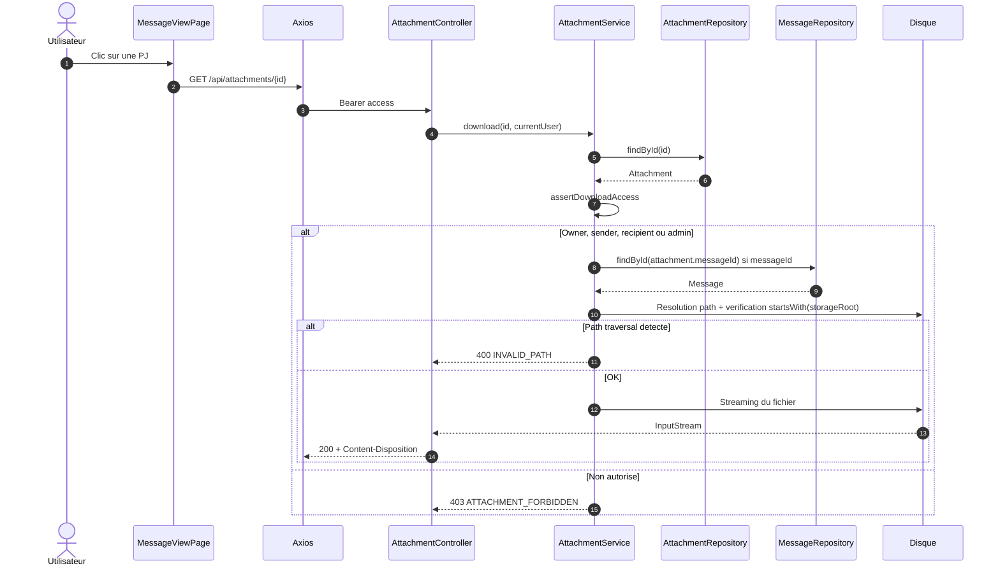
```mermaid
sequenceDiagram
    autonumber
    actor U as Utilisateur
    participant UI as MessageViewPage
    participant AX as Axios
    participant CTL as AttachmentController
    participant S as AttachmentService
    participant AR as AttachmentRepository
    participant MR as MessageRepository
    participant FS as Disque

    U->>UI: Clic sur une PJ
    UI->>AX: GET /api/attachments/{id}
    AX->>CTL: Bearer access
    CTL->>S: download(id, currentUser)
    S->>AR: findById(id)
    AR-->>S: Attachment
    S->>S: assertDownloadAccess
    alt Owner, sender, recipient ou admin
        S->>MR: findById(attachment.messageId) si messageId
        MR-->>S: Message
        S->>FS: Resolution path + verification startsWith(storageRoot)
        alt Path traversal detecte
            S-->>CTL: 400 INVALID_PATH
        else OK
            S->>FS: Streaming du fichier
            FS-->>CTL: InputStream
            CTL-->>AX: 200 + Content-Disposition
        end
    else Non autorise
        S-->>CTL: 403 ATTACHMENT_FORBIDDEN
    end
```

---

## 15. SQ-14 — Suppression (vers corbeille)

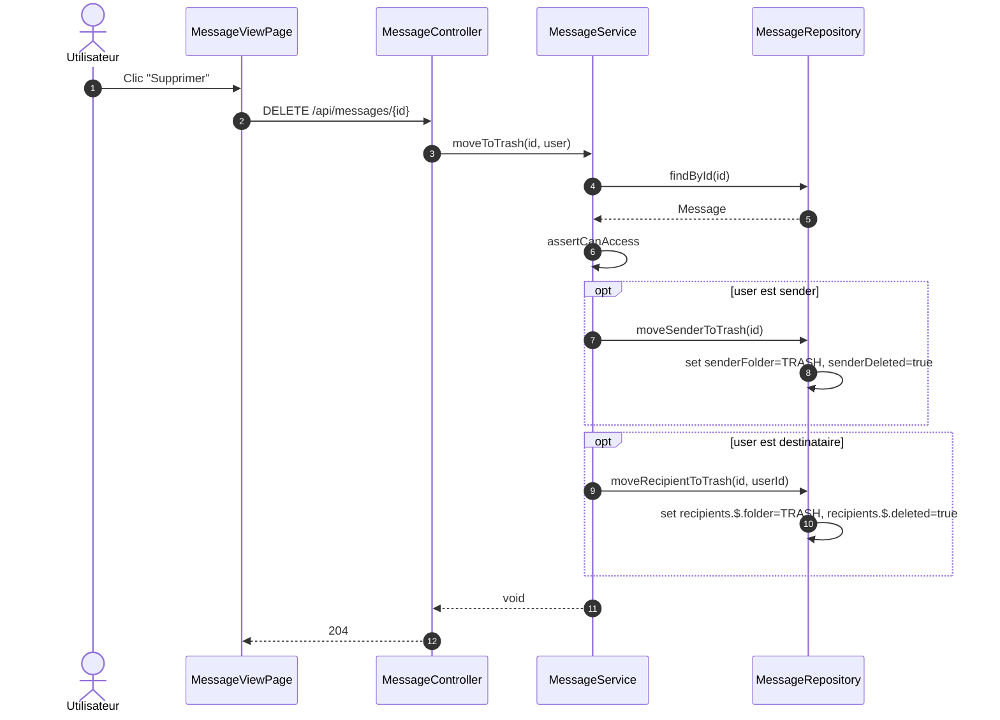
```mermaid
sequenceDiagram
    autonumber
    actor U as Utilisateur
    participant UI as MessageViewPage
    participant CTL as MessageController
    participant S as MessageService
    participant MR as MessageRepository

    U->>UI: Clic "Supprimer"
    UI->>CTL: DELETE /api/messages/{id}
    CTL->>S: moveToTrash(id, user)
    S->>MR: findById(id)
    MR-->>S: Message
    S->>S: assertCanAccess
    opt user est sender
        S->>MR: moveSenderToTrash(id)
        MR->>MR: set senderFolder=TRASH, senderDeleted=true
    end
    opt user est destinataire
        S->>MR: moveRecipientToTrash(id, userId)
        MR->>MR: set recipients.$.folder=TRASH, recipients.$.deleted=true
    end
    S-->>CTL: void
    CTL-->>UI: 204
```

**Illustration** : si l'utilisateur est **à la fois** expéditeur **et** destinataire (cas marginal : s'envoyer à soi-même), les deux `opt` s'exécutent et le message disparaît complètement de sa vue.

---

## 16. SQ-15 — Restauration

Symétrique de SQ-14 : `restoreSender(id, SENT)` et/ou `restoreRecipient(id, userId, INBOX)`.

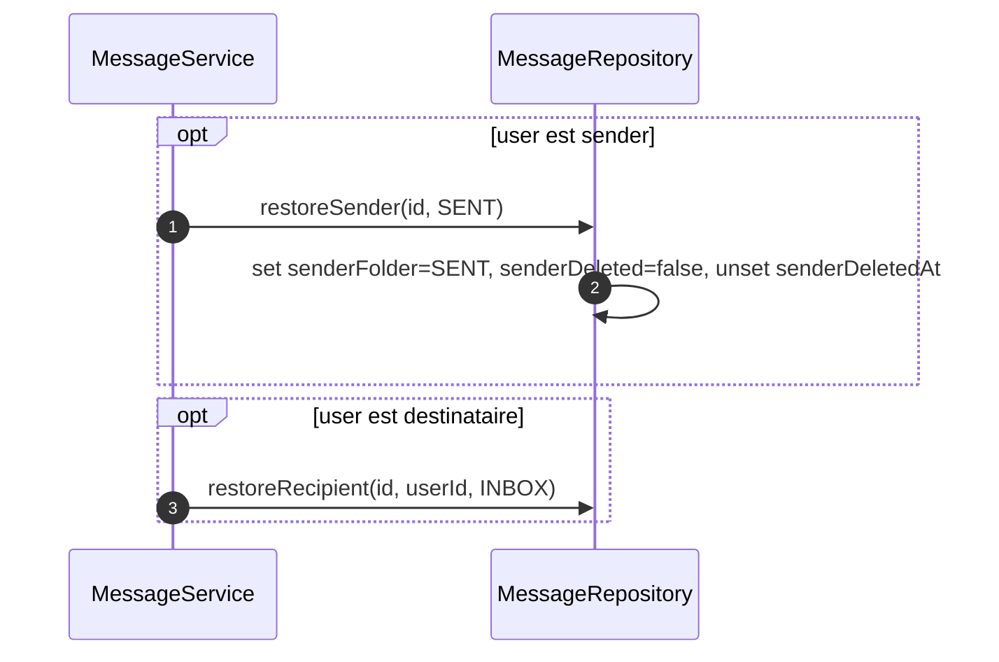
```mermaid
sequenceDiagram
    autonumber
    participant S as MessageService
    participant MR as MessageRepository
    opt user est sender
        S->>MR: restoreSender(id, SENT)
        MR->>MR: set senderFolder=SENT, senderDeleted=false, unset senderDeletedAt
    end
    opt user est destinataire
        S->>MR: restoreRecipient(id, userId, INBOX)
    end
```

---

## 17. SQ-16 — Suppression définitive

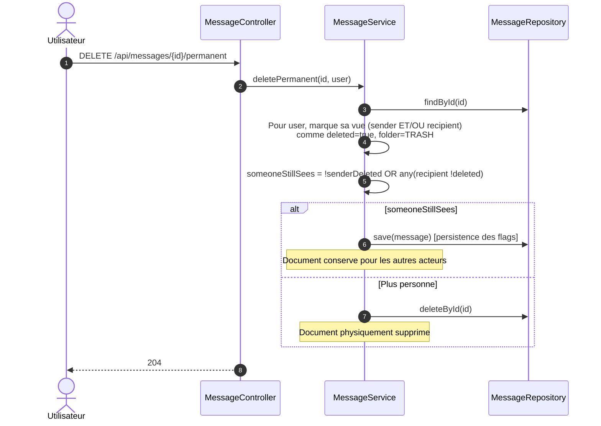
```mermaid
sequenceDiagram
    autonumber
    actor U as Utilisateur
    participant CTL as MessageController
    participant S as MessageService
    participant MR as MessageRepository

    U->>CTL: DELETE /api/messages/{id}/permanent
    CTL->>S: deletePermanent(id, user)
    S->>MR: findById(id)
    S->>S: Pour user, marque sa vue (sender ET/OU recipient)<br/>comme deleted=true, folder=TRASH
    S->>S: someoneStillSees = !senderDeleted OR any(recipient !deleted)
    alt someoneStillSees
        S->>MR: save(message) [persistence des flags]
        Note over S: Document conserve pour les autres acteurs
    else Plus personne
        S->>MR: deleteById(id)
        Note over S: Document physiquement supprime
    end
    CTL-->>U: 204
```

---

## 18. SQ-17 — Recherche

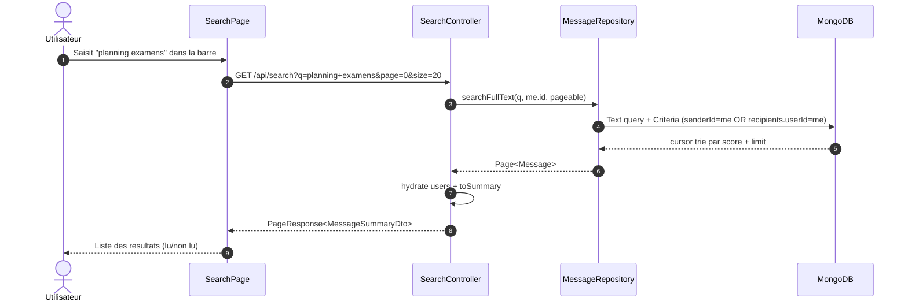
```mermaid
sequenceDiagram
    autonumber
    actor U as Utilisateur
    participant UI as SearchPage
    participant CTL as SearchController
    participant MR as MessageRepository
    participant DB as MongoDB

    U->>UI: Saisit "planning examens" dans la barre
    UI->>CTL: GET /api/search?q=planning+examens&page=0&size=20
    CTL->>MR: searchFullText(q, me.id, pageable)
    MR->>DB: Text query + Criteria (senderId=me OR recipients.userId=me)
    DB-->>MR: cursor trie par score + limit
    MR-->>CTL: Page<Message>
    CTL->>CTL: hydrate users + toSummary
    CTL-->>UI: PageResponse<MessageSummaryDto>
    UI-->>U: Liste des resultats (lu/non lu)
```

**Important** : la contrainte d'accès `(senderId OR recipients.userId)` est appliquée **avant** le tri de pertinence ; l'index texte seul ne protège pas.

---

## 19. SQ-18 — Gestion des utilisateurs (admin)

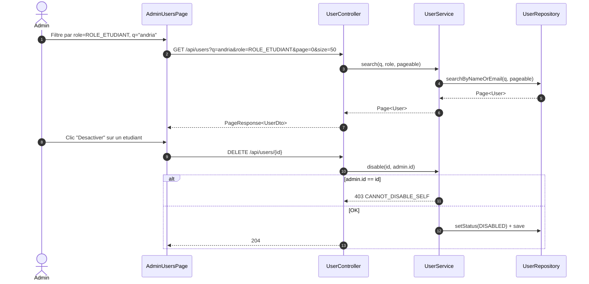
```mermaid
sequenceDiagram
    autonumber
    actor A as Admin
    participant UI as AdminUsersPage
    participant CTL as UserController
    participant S as UserService
    participant UR as UserRepository

    A->>UI: Filtre par role=ROLE_ETUDIANT, q="andria"
    UI->>CTL: GET /api/users?q=andria&role=ROLE_ETUDIANT&page=0&size=50
    CTL->>S: search(q, role, pageable)
    S->>UR: searchByNameOrEmail(q, pageable)
    UR-->>S: Page<User>
    S-->>CTL: Page<User>
    CTL-->>UI: PageResponse<UserDto>
    A->>UI: Clic "Desactiver" sur un etudiant
    UI->>CTL: DELETE /api/users/{id}
    CTL->>S: disable(id, admin.id)
    alt admin.id == id
        S-->>CTL: 403 CANNOT_DISABLE_SELF
    else OK
        S->>UR: setStatus(DISABLED) + save
        CTL-->>UI: 204
    end
```

---

## 20. SQ-19 — Gestion des groupes

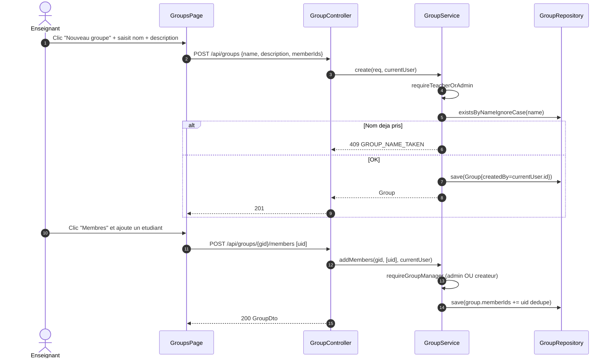
```mermaid
sequenceDiagram
    autonumber
    actor P as Enseignant
    participant UI as GroupsPage
    participant CTL as GroupController
    participant S as GroupService
    participant GR as GroupRepository

    P->>UI: Clic "Nouveau groupe" + saisit nom + description
    UI->>CTL: POST /api/groups {name, description, memberIds}
    CTL->>S: create(req, currentUser)
    S->>S: requireTeacherOrAdmin
    S->>GR: existsByNameIgnoreCase(name)
    alt Nom deja pris
        S-->>CTL: 409 GROUP_NAME_TAKEN
    else OK
        S->>GR: save(Group{createdBy=currentUser.id})
        S-->>CTL: Group
        CTL-->>UI: 201
    end
    P->>UI: Clic "Membres" et ajoute un etudiant
    UI->>CTL: POST /api/groups/{gid}/members [uid]
    CTL->>S: addMembers(gid, [uid], currentUser)
    S->>S: requireGroupManager (admin OU createur)
    S->>GR: save(group.memberIds += uid dedupe)
    CTL-->>UI: 200 GroupDto
```

---

## 21. SQ-20 — Tableau de bord administrateur

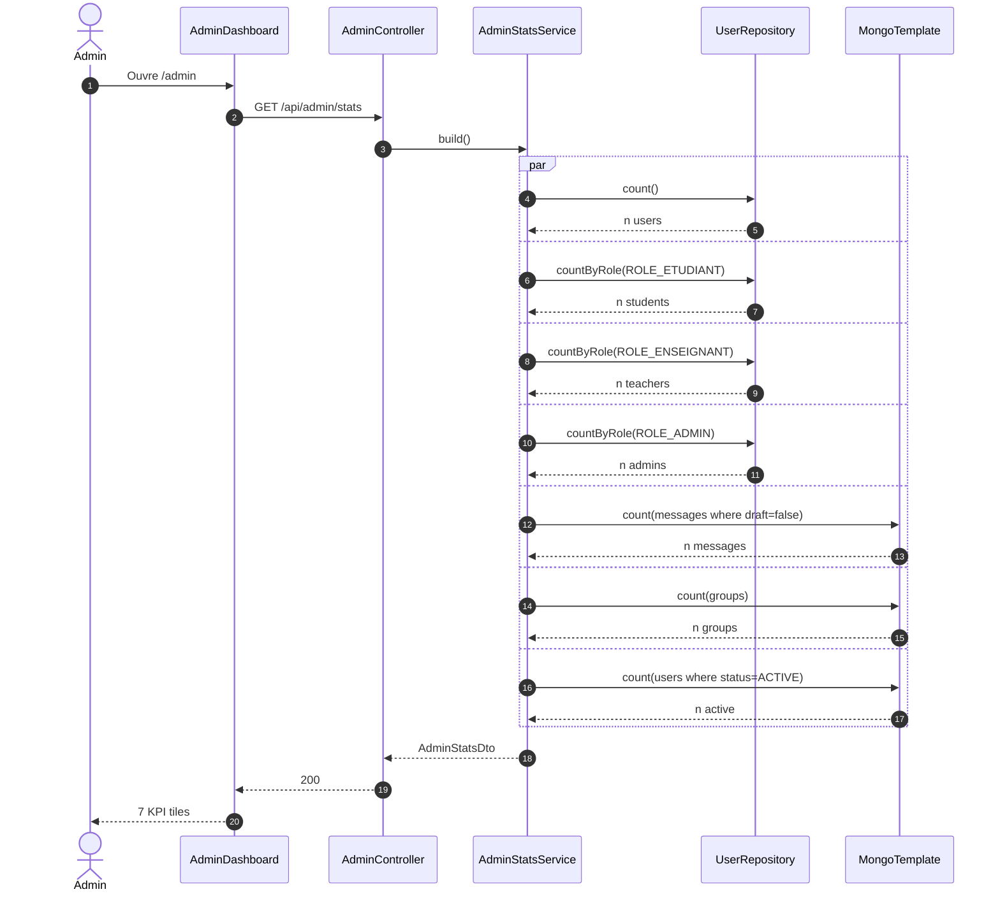
```mermaid
sequenceDiagram
    autonumber
    actor A as Admin
    participant UI as AdminDashboard
    participant CTL as AdminController
    participant S as AdminStatsService
    participant UR as UserRepository
    participant MT as MongoTemplate

    A->>UI: Ouvre /admin
    UI->>CTL: GET /api/admin/stats
    CTL->>S: build()
    par
        S->>UR: count()
        UR-->>S: n users
    and
        S->>UR: countByRole(ROLE_ETUDIANT)
        UR-->>S: n students
    and
        S->>UR: countByRole(ROLE_ENSEIGNANT)
        UR-->>S: n teachers
    and
        S->>UR: countByRole(ROLE_ADMIN)
        UR-->>S: n admins
    and
        S->>MT: count(messages where draft=false)
        MT-->>S: n messages
    and
        S->>MT: count(groups)
        MT-->>S: n groups
    and
        S->>MT: count(users where status=ACTIVE)
        MT-->>S: n active
    end
    S-->>CTL: AdminStatsDto
    CTL-->>UI: 200
    UI-->>A: 7 KPI tiles
```

---

## 22. Bonus — Refresh silencieux au boot

Ce flux est automatique au chargement de la SPA :

```mermaid
sequenceDiagram
    autonumber
    participant UI as AuthProvider.bootstrap
    participant AX as Axios
    participant CTL as AuthController
    participant AS as AuthService

    UI->>AX: POST /api/auth/refresh (envoi cookie eni_refresh)
    AX->>CTL: appel
    alt Cookie absent ou invalide
        CTL-->>AX: 401
        AX-->>UI: null
        UI-->>UI: user reste null, affiche /login
    else Cookie valide
        CTL->>AS: refresh(raw)
        AS->>AS: revoque ancien + emet nouveau (rotation)
        CTL-->>AX: 200 + {accessToken, user}
        AX-->>UI: LoginResponse
        UI->>UI: setAccessToken, setUser
        UI-->>UI: Navigation possible sans re-login
    end
```

---

## 23. Suite

→ [06-diagrammes-activite.md](06-diagrammes-activite.md) — même logique vue sous l'angle des workflows (décisions, branches).
